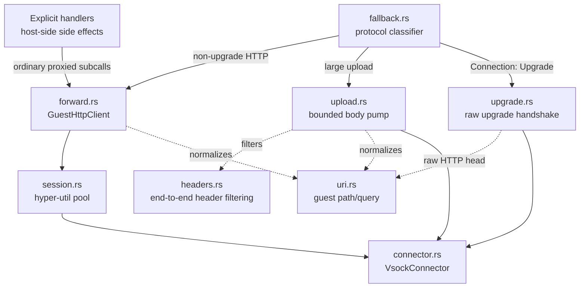
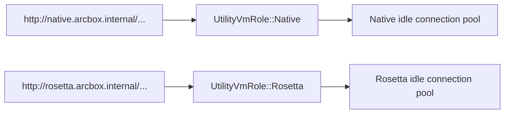
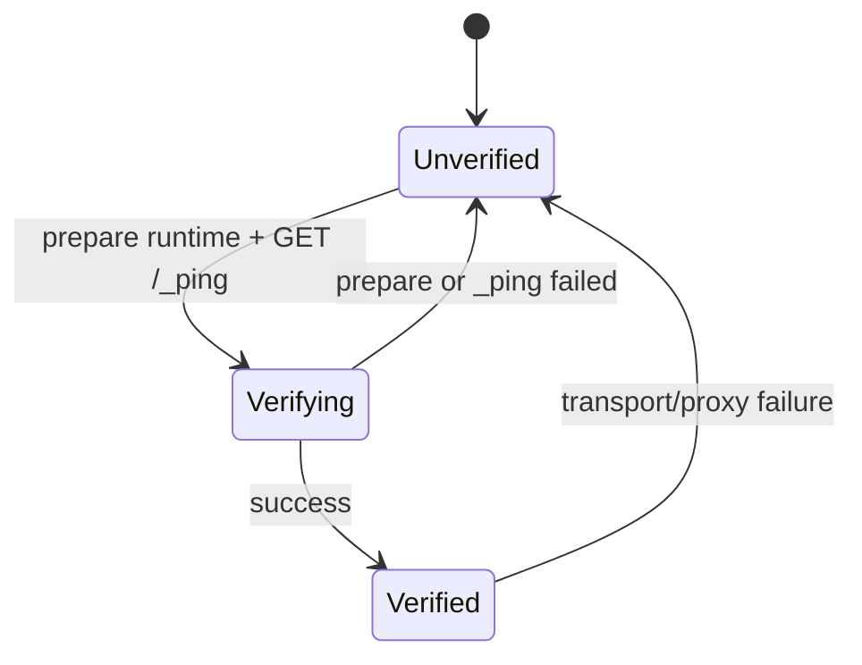

# arcbox-docker

Docker REST API compatibility layer for ArcBox.

## Overview

This crate provides a Docker-compatible API server that allows existing Docker CLI tools to work with ArcBox seamlessly. It acts as a host-side compatibility and proxy layer: some endpoints are handled by ArcBox handlers while pass-through requests are forwarded to guest `dockerd`.

## Features

- **Container Operations**: create, start, stop, kill, rm, ps, inspect, logs, exec, attach, wait, pause, unpause, top, stats
- **Image Operations**: pull, push, list, remove, tag, prune
- **Volume Operations**: create, list, inspect, remove, prune
- **Network Operations**: list, inspect, create, remove (basic)
- **System Operations**: info, version, ping, events, df

## Usage

The server listens on a Unix socket that can be configured as a Docker context:

```bash
# Create and use ArcBox Docker context
docker context create arcbox --docker "host=unix://$HOME/.arcbox/docker.sock"
docker context use arcbox

# Now Docker CLI uses ArcBox
docker ps
docker run alpine echo hello
docker images
```

## Architecture

```mermaid
flowchart LR
    cli[Docker CLI / API client]
    socket[ArcBox Docker Unix socket]
    version[Version prefix stripper<br/>/v1.xx removed for routing]
    trace[Trace middleware<br/>X-Trace-Id + tracing span]
    context[Request-context middleware<br/>resolve UtilityVmRole once]
    router[Axum router]
    handlers[ArcBox handlers<br/>only endpoints with host-side behavior]
    fallback[Smart fallback<br/>ordinary pass-through]
    proxy{Proxy protocol path}
    forward[forward.rs<br/>pooled HTTP/1.1]
    upload[upload.rs<br/>streamed uploads]
    upgrade[upgrade.rs<br/>HTTP upgrade tunnel]
    connector[connector.rs<br/>role → VM vsock]
    dockerd[guest dockerd]

    cli --> socket --> version --> trace --> context --> router
    router -->|create/start/stop/remove/build/exec-create| handlers
    router -->|all other Docker endpoints| fallback
    handlers --> proxy
    fallback --> proxy
    proxy -->|ordinary HTTP| forward
    proxy -->|build context / image load| upload
    proxy -->|attach / exec / BuildKit session| upgrade
    forward --> connector
    upload --> connector
    upgrade --> connector
    connector --> dockerd
```



The router strips Docker API version prefixes before route matching and stores
the original URI for proxy forwarding. A request-context middleware derives the
target utility VM role once from the URI and stores it in request extensions.
Requests then take one of three paths:

- **Local handlers** implement ArcBox-owned behavior such as host path
  normalization, workload role tracking, and lifecycle orchestration. The route
  table intentionally contains only these endpoints.
- **Ordinary pass-through** uses the Axum fallback for endpoints that do not
  need ArcBox-specific behavior, then relays non-upgrade HTTP/1.1 requests to
  guest `dockerd` through a pooled hyper client.
- **Special proxy forwarding** handles streaming uploads and HTTP upgrades with
  dedicated connection lifecycles instead of the ordinary pool.

Tracing spans are created at the request, routing, role-resolution, proxy, and
guest-connection boundaries. When `arcbox-daemon` runs with Sentry enabled, the
Sentry tracing layer receives these fields as context/breadcrumbs for Docker
proxy failures without logging request bodies or sensitive headers.

## Proxy Design

The proxy is split by protocol behavior rather than Docker endpoint category:



| Module | Responsibility |
| --- | --- |
| `connector.rs` | Production vsock connection establishment via `arcbox-core` runtime |
| `forward.rs` | Ordinary HTTP/1.1 request/response forwarding |
| `upload.rs` | Large streamed upload requests, including build contexts and image loads |
| `upgrade.rs` | HTTP upgrade tunnels for attach, exec, and BuildKit-style streams |
| `fallback.rs` | Catch-all forwarding for routes not explicitly handled by Axum |
| `headers.rs` | End-to-end header filtering and forwarding rules |
| `session.rs` | Guest HTTP client/session setup and pooled client adapter |
| `uri.rs` | Guest path/query normalization |

### Ordinary HTTP forwarding

Ordinary non-upgrade requests use `GuestHttpClient`, which wraps
`hyper-util::client::legacy::Client` with HTTP/1.1 connection pooling:

- up to 8 idle guest connections per internal authority;
- 30 second idle timeout;
- response bodies stream back to the Docker CLI without full buffering;
- hyper-util returns a connection to the pool only after the response body is
  fully consumed, and discards it if the body is dropped early or errors.

The pool key is the request URI authority, so ArcBox uses internal authorities
to separate utility VM roles:



The internal authority is only for hyper-util pooling and role selection. The
guest request still carries `Host: localhost` and is sent over the selected
vsock connection.

### Upload and upgrade paths

Streaming uploads and HTTP upgrades intentionally do not use the ordinary
pooled client:

- upload forwarding can return the guest response while the client request body
  is still draining in the background;
- upgrade forwarding takes ownership of the raw HTTP/1.1 connection and then
  tunnels bytes after the `101 Switching Protocols` response.

Keeping these paths on dedicated connections avoids corrupting pooled HTTP/1.1
state with partially-drained request bodies or upgraded protocols.

### Guest transport

Production proxy connections are opened through `VsockConnector`, which asks
`arcbox-core` for the selected utility VM's dockerd vsock port. The underlying
file descriptor is wrapped by `arcbox_transport::vsock::VsockStream`, giving
the proxy one async stream abstraction for both production vsock and Unix-socket
integration tests.

### Guest Docker readiness

`arcbox-core` owns the slow readiness path: starting the utility VM, asking the
guest agent to ensure the container runtime, and validating the reported vsock
endpoint. `arcbox-docker` owns Docker HTTP readiness because only the proxy can
prove that guest `dockerd` accepted and answered a real Docker request.

Before a request is forwarded, `ProxyState` asks `GuestDockerReadiness` to
verify the selected `UtilityVmRole`. Readiness is tracked per role with an
explicit state machine:



Only one caller performs the runtime preparation and `_ping` while a role is in
`Verifying`; concurrent callers wait for the state change and then reuse the
result. Any forwarding, upload, or upgrade transport error invalidates that
role's readiness so the next request re-runs the slow readiness path and then
verifies guest `dockerd` with another `_ping`.

This keeps the ownership boundary clear:

- `arcbox-core`: VM lifecycle, guest agent runtime readiness, endpoint shape.
- `arcbox-docker`: HTTP verification, readiness caching, transport-failure
  invalidation.

## API Version

- **Host route compatibility:** `/v1.24` through `/v1.43` plus unversioned routes
- **Version payload source:** `/version` and related system metadata are reported by guest `dockerd`

## Testing

Focused proxy checks:

```bash
cargo test -p arcbox-docker proxy::
cargo test -p arcbox-docker --test proxy_integration
cargo test -p arcbox-docker api::tests::readiness
```

The integration tests run against a mock guest `dockerd` over a Unix socket, so
they do not require a VM. They cover ordinary forwarding, pooled session reuse,
early body-drop discard behavior, streaming forwarding, and HTTP upgrade
handling. The readiness unit tests cover the explicit state transitions,
per-role isolation, invalidation, and concurrent verification serialization.

## License

MIT OR Apache-2.0
